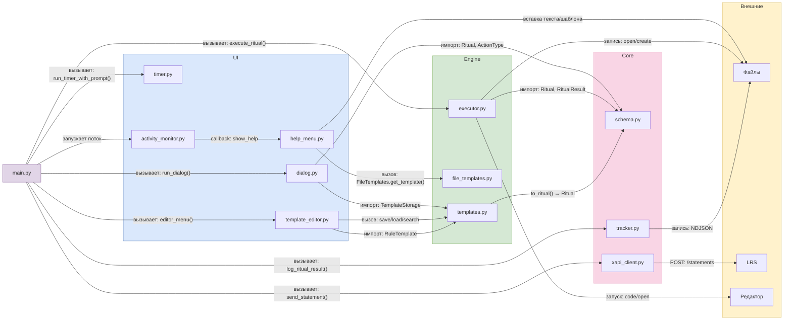
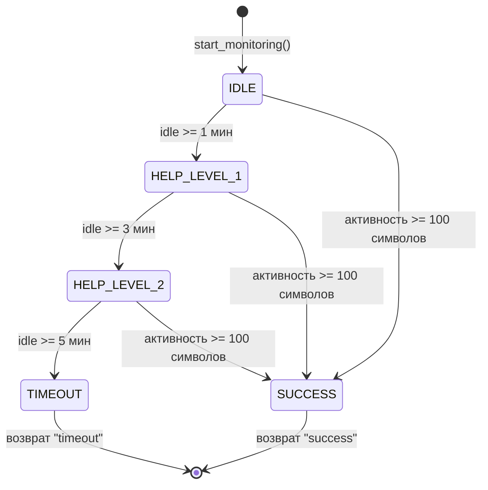

# ARCHITECTURE — Архитектура системы

> Документ описывает структуру проекта, взаимодействие модулей и зоны ответственности участников.

---

## 1. Общая схема архитектуры

Проект построен по трёхслойной архитектуре с чётким разделением ответственности:

```
МАШКА!!!!!
```


---

## 2. Структура проекта

```
white-list-breaker/
├── src/
│   └── breaker/
│       ├── __init__.py
│       ├── __main__.py
│       ├── main.py                     # Оркестратор
│       │
│       ├── core/                       # Участник А: ядро
│       │   ├── __init__.py
│       │   ├── schema.py               # Модели данных
│       │   ├── tracker.py              # NDJSON-логирование
│       │   └── xapi_client.py          # xAPI-клиент
│       │
│       ├── engine/                     # Участник Б: исполнение
│       │   ├── __init__.py
│       │   ├── executor.py             # Создание/открытие файлов
│       │   ├── file_templates.py       # Генератор шаблонов
│       │   └── exceptions.py           # Исключения
│       │
│       ├── storage/                    # Участник Б: хранилище
│       │   ├── __init__.py
│       │   └── templates.py            # Шаблоны правил
│       │
│       └── ui/                         # Участник В: интерфейс
│           ├── __init__.py
│           ├── dialog.py               # Интерактивный диалог
│           ├── timer.py                # Pomodoro-таймер
│           ├── template_editor.py      # Редактор шаблонов
│           ├── activity_monitor.py     # Фоновое наблюдение
│           └── help_menu.py            # Меню помощи
│
├── tests/                              # Тесты (300+)
├── docs/                               # Документация
│   ├── README.md
│   ├── DOMAIN.md
│   ├── SPECIFICATION.md
│   ├── ARCHITECTURE.md
│   └── IMPLEMENTATION.md
│
├── logs/                               # Логи в NDJSON
├── configs/                            # Конфигурации
├── data/                               # Данные (звуки, примеры)
├── pyproject.toml                      # Конфигурация проекта
├── requirements.txt                    # Зависимости
├── Makefile                            # Команды разработки
└── README.md                           # Главный README
```

---

## 3. Зоны ответственности

| Участник | Зона | Модули | Ответственность |
|---|---|---|---|
| **А** | Core (ядро) | `schema.py`, `tracker.py`, `xapi_client.py` | Модели данных, логирование, xAPI-интеграция |
| **Б** | Engine + Storage | `executor.py`, `file_templates.py`, `templates.py`, `exceptions.py` | Работа с файлами, генерация шаблонов, хранилище правил |
| **В** | UI | `dialog.py`, `timer.py`, `template_editor.py`, `activity_monitor.py`, `help_menu.py` | Взаимодействие с пользователем |

---

## 4. Описание модулей

### Слой Core (ядро)

- **`schema.py`** — центральная модель данных. Определяет `Ritual`, `RitualResult`, `ActionType` (OPEN_FILE, CREATE_TEST), `XapiStatement` и связанные классы.
- **`tracker.py`** — логирование в формате NDJSON. Функции: `log_ritual_result()`, `read_log()`, `get_stats()`, `clear_log()`.
- **`xapi_client.py`** — отправка стейтментов в LRS. Поддерживает режимы `mock` (stdout) и `real` (HTTP POST).

### Слой Engine (исполнение)

- **`executor.py`** — исполнение микро-шагов. Функции: `execute_ritual()`, `open_file()`, `create_test()`, `_detect_template_by_extension()`.
- **`file_templates.py`** — класс `FileTemplates` с методами генерации шаблонов для Python, Markdown, JSON, YAML, Text.
- **`exceptions.py`** — иерархия исключений: `EngineError`, `BreakerFileNotFoundError`, `CommandNotFoundError`, `CommandTimeoutError`, `CommandFailedError`.

### Слой Storage

- **`templates.py`** — класс `TemplateStorage` для работы с файлом `~/.white-sheet-breaker/templates.json`. Различает системные и пользовательские шаблоны.

### Слой UI

- **`dialog.py`** — интерактивный диалог из 4 вопросов (signal, action, file_mode, target) + подтверждение правила.
- **`timer.py`** — Pomodoro-таймер с прогресс-баром Rich, поддержкой WSL и кроссплатформенным воспроизведением звука.
- **`template_editor.py`** — CRUD-редактор шаблонов правил.
- **`activity_monitor.py`** — фоновое наблюдение, реализованное как конечный автомат (IDLE → HELP_LEVEL_1 → HELP_LEVEL_2 → TIMEOUT).
- **`help_menu.py`** — адаптивные меню помощи (2 уровня), адаптирующиеся под тип файла.

### Оркестратор

- **`main.py`** — связывает все модули в единый цикл работы. Управляет последовательностью: правило → выполнение → таймер + наблюдение → логирование → xAPI.

---

## 5. Взаимодействие модулей




**Ключевые моменты:**

- Все модули UI и Engine импортируют модели из `core/schema.py`, что обеспечивает единую модель данных.
- `main.py` запускает фоновое наблюдение в потоке, чтобы оно работало параллельно с таймером.
- `activity_monitor.py` вызывает функции из `help_menu.py` через колбэки, что обеспечивает слабую связанность.
- `help_menu.py` использует `file_templates.py` для вставки шаблонов в файлы.

---

## 6. Конечный автомат ActivityMonitor




---

## 7. Связь с другими документами

- [DOMAIN.md](./DOMAIN.md) — предметная область и психологическая основа
- [SPECIFICATION.md](./SPECIFICATION.md) — функциональные и нефункциональные требования
- [IMPLEMENTATION.md](./IMPLEMENTATION.md) — описание реализованной системы
