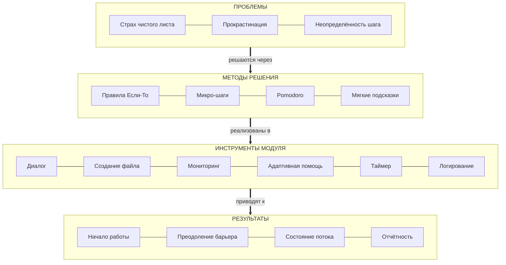

# DOMAIN — Предметная область

> Документ описывает проблемную область, ключевые понятия и психологическую основу проекта White-sheet-breaker.

---

## 1. Описание проблемной области

Проект **White-sheet-breaker** работает в предметной области **преодоления прокрастинации** через техники поведенческой психологии и формализации намерений.

### Ключевая проблема

Когда человек сталкивается с новой задачей (пустой файл, чистый лист, незнакомый проект), возникает **психологическое сопротивление** — когнитивная нагрузка от неопределённости блокирует начало работы. Это явление известно как "paralysis by analysis" (паралич анализа).

### Гипотеза проекта

Формализация намерения в виде конкретного правила «ЕСЛИ [сигнал] -> ТО [действие]» + немедленное выполнение микро-шага:

- Снижает когнитивную нагрузку (задача декомпозируется)
- Преодолевает психологическое сопротивление (первый шаг сделан)
- Помогает войти в состояние потока (flow state)

---

## 2. Ключевые понятия предметной области

| Термин | Определение | Пример |
|---|---|---|
| **Правило «если-то»** (If-Then Rule) | Формализованное намерение, связывающее ситуацию с действием | "ЕСЛИ файл пуст -> ТО напишу класс" |
| **Сигнал** (Signal) | Ситуация, триггер, блокирующая ситуация | "файл пуст", "нет тестов" |
| **Действие** (Action) | Конкретный микро-шаг, который нужно выполнить | "напишу класс", "создам README" |
| **Цель** (Target) | Ресурс, над которым выполняется действие | `classes.py`, `README.md` |
| **Микро-шаг** (Micro-step) | Минимальное выполнимое действие, преодолевающее барьер | Создание файла с шаблоном |
| **Прокрастинация** | Откладывание начала работы из-за психологического сопротивления | "Начну потом", "Сначала подумаю" |
| **Поток** (Flow) | Состояние полной концентрации на задаче | Работа без отвлечений |
| **Pomodoro** | Техника управления временем: интервалы работы и отдыха | 25 мин работы + 5 мин отдыха |
| **Ритуал** (Ritual) | Последовательность действий для начала работы | Правило → микро-шаг → наблюдение |

---

## 3. Психологическая основа

Проект опирается на следующие научно обоснованные концепции:

### 3.1 Implementation Intentions (Peter Gollwitzer, 1999)

> "Люди, формулирующие намерения в формате «ЕСЛИ X, ТО Y», значительно чаще достигают целей."

Формат «если-то» создаёт ментальную связь между ситуацией и действием, автоматизируя реакцию.

### 3.2 Two-Minute Rule (David Allen, GTD)

> "Если действие занимает меньше 2 минут — сделай его сейчас."

Микро-шаги снижают психологический барьер начала работы.

### 3.3 Pomodoro Technique (Francesco Cirillo)

> "Работа интервалами по 25 минут с короткими перерывами повышает продуктивность."

Таймер создаёт структуру времени и снижает сопротивление.

### 3.4 Zeigarnik Effect

> "Незавершённые задачи запоминаются лучше завершённых."

Начало работы (даже микро-шаг) создаёт психологическое давление завершения.

---

## 4. Целевая аудитория

| Аудитория | Характеристика | Потребность |
|---|---|---|
| **Студенты-программисты** | Изучают программирование, сталкиваются с прокрастинацией | Помощь в начале лабораторных, курсовых |
| **Junior-разработчики** | Начинают работать с новыми проектами | Преодоление страха "чистого листа" |
| **Технические специалисты** | Работают в терминале, ценят CLI-инструменты | Интеграция в рабочий процесс |
| **Преподаватели** | Хотят отслеживать прогресс студентов | xAPI-интеграция с LMS |

---

## 5. Концептуальная модель

Диаграмма ниже показывает связь между психологией, методологией, инструментом и результатом:

---

## 6. Связь с образовательными стандартами

Проект интегрируется с:

- **xAPI (Experience API)** — стандарт обмена данными об обучении
- **LRS (Learning Record Store)** — хранилище учебных записей
- **LMS (Learning Management System)** — системы управления обучением

Это позволяет преподавателям отслеживать:

- Факт начала работы студента
- Время, затраченное на задачу
- Использование помощи модуля
- Успешность выполнения микро-шагов

---

## 7. Бизнес-ценность

### Для пользователя:

- Снижение времени на начало работы
- Преодоление прокрастинации
- Структурированный подход к задачам
- Помощь в моменты бездействия

### Для преподавателя:

- Отслеживание активности студентов
- Объективные данные о начале работы
- Интеграция с LMS через xAPI
- Возможность анализа эффективности заданий

### Для образовательной организации:

- Соответствие стандартам xAPI
- Масштабируемость решения
- Сбор аналитики учебного процесса

---

## 8. Границы предметной области

### Входит в предметную область:

- Преодоление прокрастинации при начале работы
- Формализация намерений через правила «если-то»
- Помощь в создании первых артефактов (файлов, документов)
- Отслеживание прогресса через xAPI

### НЕ входит в предметную область:

- Написание кода за пользователя (как Copilot)
- Управление проектами (как Jira, Trello)
- Обучение программированию (как учебники)

---

## 9. Связь с другими документами

- [SPECIFICATION.md](./SPECIFICATION.md) — что конкретно должна делать система
- [ARCHITECTURE.md](./ARCHITECTURE.md) — как система устроена технически
- [IMPLEMENTATION.md](./IMPLEMENTATION.md) — как система реализована

---
